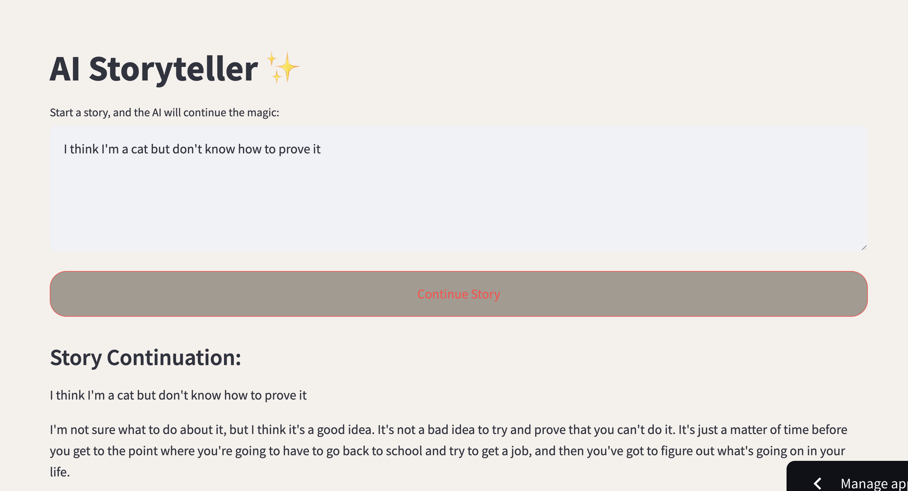
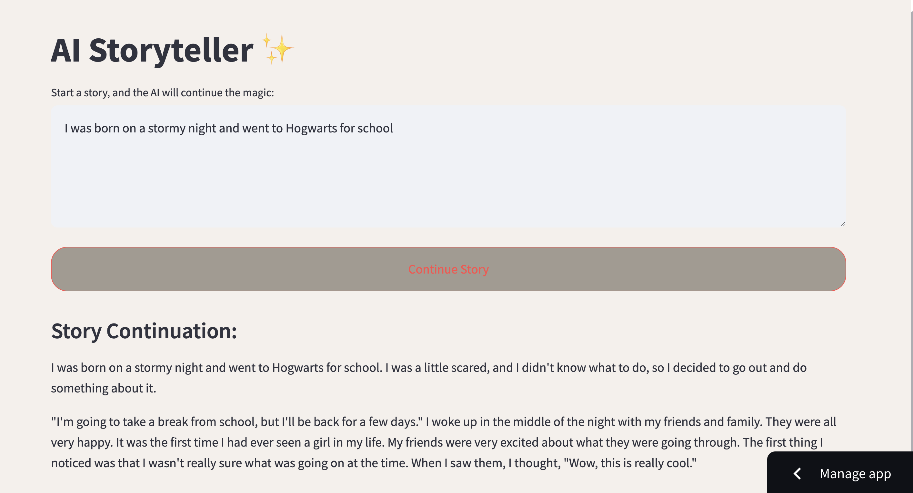

# ✨ AI Storyteller 

**—— A Streamlit App Powered by HuggingFace LLM**

Stuck with a severe case of writer's block? Have the setting you envisioned but paralyzed with too many options for continuing the story? Try [AI Storyteller](https://hollyyfc-aistoryteller.streamlit.app/)! Be it a poem, novel or creative essay, we've got your back to help you get over the hump. A little assistance can unleash a lot of creativity.

The web app itself is built with [Streamlit](https://streamlit.io/) and powered by [HuggingFace](https://huggingface.co/distilbert/distilgpt2)'s `distilgpt2` model, an English-language model pre-trained with the supervision of the smallest version of Generative Pre-trained Transformer 2 (GPT-2) for resource and response efficiency. The application invites users to kick-start a story with their own sentences, which the AI then elaborates on, spinning the tale further with imaginative continuity. The UI is crafted with a soothing Morandi color scheme, offering a visually pleasing and user-friendly environment for storytelling enthusiasts and casual users alike. 

## Demo

Ready to get your hands on? Just type the opening line of your tale into the textbox and watch as our clever AI conjures up the next part of your story! Let this genie in your browser do the magic and wait for something fun 🧞‍♂️

*Note: Due to the size of the model and the input, the response time might vary between 4 to 7 seconds. Beware of refresh or multiple hits of the button!*

